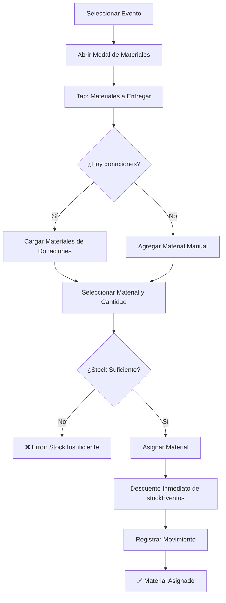
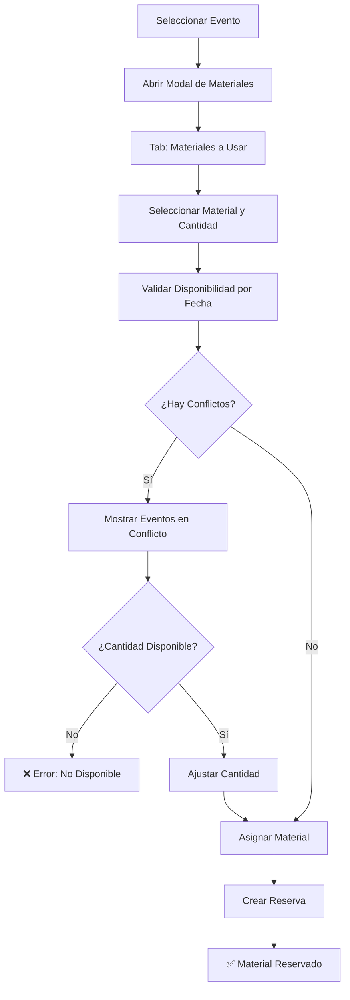
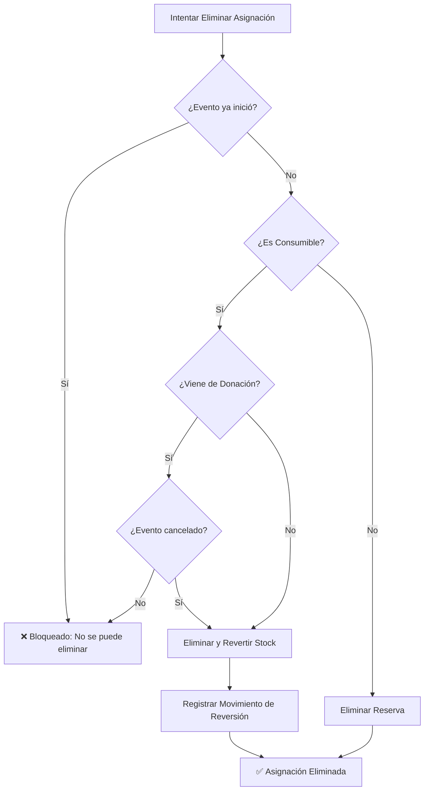

# Guía Completa del Sistema de Materiales para Eventos

## 📋 Índice

1. [Introducción](#introducción)
2. [Conceptos Fundamentales](#conceptos-fundamentales)
3. [Tipos de Materiales](#tipos-de-materiales)
4. [Flujos de Trabajo](#flujos-de-trabajo)
5. [Sistema de Stock](#sistema-de-stock)
6. [Validaciones y Restricciones](#validaciones-y-restricciones)
7. [Sistema de Bajas](#sistema-de-bajas)
8. [Casos de Uso Prácticos](#casos-de-uso-prácticos)
9. [Preguntas Frecuentes](#preguntas-frecuentes)

---

## Introducción

Este documento describe el funcionamiento completo del sistema de gestión de materiales para eventos de la Fundación Astrostar. El sistema está diseñado para manejar dos tipos de materiales con comportamientos completamente diferentes:

- **Materiales Consumibles**: Se entregan a los participantes y no regresan
- **Materiales Reutilizables**: Se prestan durante el evento y deben regresar

---

## Conceptos Fundamentales

### ¿Qué es un Material?

Un material es cualquier elemento físico que la fundación utiliza o entrega en sus eventos. Cada material tiene:

- **Nombre y descripción**: Identificación del material
- **Categoría**: Clasificación (ej: Balones, Uniformes, Equipamiento)
- **Unidad de medida**: Cómo se cuenta (unidad, par, set, kg, etc.)
- **Estado**: Activo o Inactivo
- **Tipo**: Reutilizable (stock fundación) o Consumible (stock eventos)

### Inventarios Separados

El sistema maneja **DOS inventarios completamente independientes**:

1. **Stock Fundación** (`stockFundacion`):
   - Patrimonio de la fundación
   - Para materiales reutilizables
   - NO se descuenta, solo se reserva por fechas

2. **Stock Eventos** (`stockEventos`):
   - Para entregar en eventos
   - Para materiales consumibles
   - SE descuenta inmediatamente al asignar

> ⚠️ **Importante**: Un mismo material puede tener stock en ambos inventarios si es necesario

---

## Tipos de Materiales

### 1. Materiales CONSUMIBLES (a entregar)

#### Características

✅ Se entregan a los participantes  
✅ NO regresan a la fundación  
✅ Se descontan INMEDIATAMENTE del `stockEventos`  
✅ Pueden venir de donaciones o compras  
❌ NO necesitan validación por fecha (no se reutilizan)

#### Origen del Stock

**Donaciones**:

- Cuando se recibe una donación de materiales, se puede asignar directamente a eventos
- Estos materiales quedan "bloqueados" (no se pueden eliminar manualmente)
- Solo se pueden eliminar si el evento se cancela ANTES de su fecha de inicio

**Compras/Ingresos Manuales**:

- Se agregan al `stockEventos` mediante movimientos de tipo INGRESO
- Se pueden asignar libremente a eventos
- Se pueden eliminar si el evento no ha iniciado

#### Flujo de Stock

```
Stock Inicial: 100 unidades
│
├─ Asignar 50 al Evento A (5 marzo) → Stock: 50 ✅
│
├─ Asignar 30 al Evento B (10 marzo) → Stock: 20 ✅
│
├─ Intentar asignar 30 al Evento C → ❌ ERROR (solo quedan 20)
│
└─ Si Evento A se cancela ANTES del 5 marzo:
   └─ Eliminar asignación → Stock: 70 ✅ (reversión)
```

#### Ejemplos

- Camisetas deportivas para donar
- Balones para entregar
- Medallas y trofeos
- Material didáctico
- Refrigerios empacados

---

### 2. Materiales REUTILIZABLES (a usar)

#### Características

✅ Son patrimonio de la fundación  
✅ Se prestan durante el evento  
✅ DEBEN regresar después del evento  
✅ Sistema de reservas por fecha  
✅ Validación de disponibilidad con detección de conflictos  
❌ NO se descuenta el `stockFundacion`

#### Sistema de Reservas por Fecha

El sistema valida que no haya conflictos de fechas entre eventos:

**Conflicto**: Dos eventos que se solapan en fechas y requieren más unidades de las disponibles

**Disponibilidad**: Se calcula considerando todos los eventos activos en el rango de fechas

#### Flujo de Reservas

```
Stock Fundación: 50 conos
│
├─ Evento A (5-7 marzo): Reservar 30 conos
│  └─ ✅ Disponible (50 - 0 = 50)
│
├─ Evento B (10-12 marzo): Reservar 40 conos
│  └─ ✅ Disponible (no se solapa con A)
│
├─ Evento C (6-8 marzo): Reservar 30 conos
│  └─ ❌ CONFLICTO con Evento A
│      Disponible: 20 conos (50 - 30 del Evento A)
│
└─ Evento C (6-8 marzo): Reservar 20 conos
   └─ ✅ Disponible
```

#### Cálculo de Uso Máximo Concurrente

El sistema calcula cuántas unidades están en uso simultáneamente:

```
Evento A: 30 conos (5-7 marzo)
Evento C: 20 conos (6-8 marzo)
─────────────────────────────────
Uso máximo concurrente: 50 conos (días 6-7 marzo)
Disponible mínimo: 0 conos
```

#### Ejemplos

- Conos de entrenamiento
- Cronómetros
- Silbatos
- Redes deportivas
- Arcos portátiles
- Equipamiento técnico

---

## Flujos de Trabajo

### Flujo 1: Asignar Material Consumible



### Flujo 2: Asignar Material Reutilizable



### Flujo 3: Eliminar Asignación



---

## Sistema de Stock

### Stock Fundación (Reutilizables)

**Operaciones que afectan el stock**:

1. **INGRESO**: Compra o donación de materiales
   - Aumenta `stockFundacion`
   - Requiere: cantidad, fecha, proveedor (opcional)

2. **BAJA**: Material dañado, perdido o desechado
   - Disminuye `stockFundacion`
   - Requiere: tipo de baja, motivo

3. **AJUSTE**: Corrección de inventario
   - Puede aumentar o disminuir
   - Requiere: motivo del ajuste

**NO afectan el stock**:

- Asignaciones a eventos (solo reservas)
- Eliminación de reservas

### Stock Eventos (Consumibles)

**Operaciones que afectan el stock**:

1. **INGRESO**: Compra o donación
   - Aumenta `stockEventos`

2. **ASIGNACION_EVENTO**: Asignar a evento
   - Disminuye `stockEventos` INMEDIATAMENTE

3. **REVERSION_ASIGNACION**: Cancelar asignación
   - Aumenta `stockEventos` (solo si evento no inició)

4. **BAJA**: Material dañado antes de asignar
   - Disminuye `stockEventos`

5. **TRANSFERENCIA**: Mover entre inventarios
   - De `stockEventos` a `stockFundacion` o viceversa

### Movimientos de Stock

Cada operación genera un registro en `MaterialMovement`:

```javascript
{
  materialId: 1,
  tipoMovimiento: "INGRESO" | "BAJA" | "ASIGNACION_EVENTO" | "REVERSION_ASIGNACION" | "AJUSTE" | "TRANSFERENCIA",
  cantidad: 10,
  stockAnterior: 50,
  stockNuevo: 60,
  observaciones: "Descripción del movimiento",
  fecha: "2026-03-07",
  createdBy: 1,
  createdByName: "Juan Pérez",

  // Campos específicos según tipo
  eventoId: 123,           // Para ASIGNACION_EVENTO
  donacionId: 456,         // Si viene de donación
  proveedorId: 789,        // Para INGRESO con proveedor
  tipoBaja: "DAÑADO",      // Para BAJA
  destinoStock: "EVENTOS", // Para TRANSFERENCIA
  inventarioOrigen: "fundacion",  // Para TRANSFERENCIA
  inventarioDestino: "eventos"    // Para TRANSFERENCIA
}
```

---

## Validaciones y Restricciones

### Validaciones para Materiales Consumibles

1. **Stock Disponible**:

   ```
   cantidadSolicitada <= stockEventos
   ```

2. **Evento No Iniciado** (para eliminar):

   ```
   fechaActual < fechaInicioEvento
   ```

3. **Donación No Bloqueada** (para eliminar):
   ```
   bloqueado === false || eventoCancelado === true
   ```

### Validaciones para Materiales Reutilizables

1. **Disponibilidad por Fecha**:

   ```javascript
   // Obtener todos los eventos en el rango de fechas
   const eventosEnRango = eventos.filter(
     (e) =>
       e.fechaInicio <= fechaFinEvento &&
       e.fechaFin >= fechaInicioEvento &&
       e.id !== eventoActual.id,
   );

   // Calcular uso máximo concurrente
   const usoMaximo = calcularUsoConcurrente(eventosEnRango);

   // Validar disponibilidad
   const disponible = stockFundacion - usoMaximo;

   if (cantidadSolicitada > disponible) {
     throw new Error(`Solo hay ${disponible} unidades disponibles`);
   }
   ```

2. **Detección de Conflictos**:

   ```javascript
   const conflictos = eventosEnRango.filter((e) => {
     const usoConEsteEvento = calcularUsoConcurrente([
       ...eventosEnRango,
       eventoActual,
     ]);
     return usoConEsteEvento > stockFundacion;
   });
   ```

3. **Evento No Iniciado** (para eliminar):
   ```
   fechaActual < fechaInicioEvento
   ```

### Restricciones Generales

1. **No se puede editar** si el evento ya inició
2. **No se puede eliminar** material de donación bloqueado (excepto si evento se cancela)
3. **No se puede asignar** más de lo disponible
4. **No se puede dar de baja** más de lo que hay en stock

---

## Sistema de Bajas

### Tipos de Baja

El sistema soporta diferentes tipos de baja según el motivo:

```javascript
enum TipoBaja {
  DAÑADO      // Material en mal estado
  PERDIDO     // Material extraviado
  OBSOLETO    // Material fuera de uso
  VENCIDO     // Material caducado
  DONADO      // Material donado a terceros
  OTRO        // Otro motivo
}
```

### Proceso de Baja

1. **Seleccionar Material**: Elegir el material a dar de baja
2. **Elegir Inventario**: ¿De dónde se da de baja?
   - Stock Fundación (reutilizables)
   - Stock Eventos (consumibles)
3. **Especificar Cantidad**: Cuántas unidades
4. **Tipo de Baja**: Seleccionar motivo
5. **Observaciones**: Descripción detallada del motivo
6. **Confirmar**: El sistema:
   - Descuenta del stock correspondiente
   - Registra el movimiento
   - Genera reporte de baja

### Restricciones de Baja

❌ **NO se puede dar de baja**:

- Más unidades de las disponibles en stock
- Materiales que están asignados a eventos activos (reutilizables)
- Si el stock resultante sería negativo

✅ **SÍ se puede dar de baja**:

- Materiales en stock sin asignar
- Materiales consumibles ya asignados (si se dañaron antes del evento)
- Materiales reutilizables si no están en uso

### Ejemplo de Baja

```
Material: Conos de Entrenamiento
Stock Fundación: 50 unidades
Eventos activos usando: 30 unidades (Evento A: 5-7 marzo)

Intento de baja: 25 conos
├─ Stock disponible: 50 - 30 = 20 conos
├─ Cantidad solicitada: 25 conos
└─ ❌ ERROR: Solo se pueden dar de baja 20 conos

Intento de baja: 15 conos
├─ Stock disponible: 20 conos
├─ Cantidad solicitada: 15 conos
├─ ✅ Baja exitosa
└─ Nuevo stock: 35 conos (20 disponibles, 15 dados de baja)
```

---

## Casos de Uso Prácticos

### Caso 1: Torneo Infantil con Camisetas

**Contexto**:

- Evento: Torneo Infantil
- Fecha: 15 de marzo
- Participantes: 100 niños
- Material: Camisetas deportivas (consumible)

**Flujo**:

1. **Recibir Donación**:

   ```
   Donación #123: 150 camisetas
   → stockEventos: 150
   ```

2. **Cargar Materiales de Donación**:

   ```
   Asignar 100 camisetas al Torneo Infantil
   → stockEventos: 50
   → Material bloqueado (viene de donación)
   ```

3. **Día del Evento**:

   ```
   Se entregan las 100 camisetas a los niños
   → Las camisetas NO regresan
   → Stock permanece en 50
   ```

4. **Si el Evento se Cancela** (antes del 15 marzo):
   ```
   Eliminar asignación
   → stockEventos: 150 (reversión)
   → Material desbloqueado
   ```

---

### Caso 2: Múltiples Eventos con Conos

**Contexto**:

- Material: Conos de entrenamiento (reutilizable)
- Stock Fundación: 50 conos
- Eventos programados:
  - Evento A: 5-7 marzo (30 conos)
  - Evento B: 10-12 marzo (40 conos)
  - Evento C: 6-8 marzo (¿? conos)

**Flujo**:

1. **Asignar Evento A** (5-7 marzo):

   ```
   Solicitud: 30 conos
   Validación: No hay eventos en esas fechas
   → ✅ Asignación exitosa
   ```

2. **Asignar Evento B** (10-12 marzo):

   ```
   Solicitud: 40 conos
   Validación: No se solapa con Evento A
   → ✅ Asignación exitosa
   ```

3. **Asignar Evento C** (6-8 marzo):

   ```
   Solicitud: 30 conos
   Validación: Se solapa con Evento A (5-7 marzo)

   Cálculo:
   - Evento A usa: 30 conos (5-7 marzo)
   - Evento C necesita: 30 conos (6-8 marzo)
   - Uso concurrente: 60 conos (días 6-7)
   - Stock disponible: 50 conos

   → ❌ ERROR: Conflicto detectado
   → Disponible: 20 conos (50 - 30)
   ```

4. **Ajustar Evento C**:

   ```
   Solicitud: 20 conos
   Validación: 30 + 20 = 50 conos (uso máximo)
   → ✅ Asignación exitosa
   ```

5. **Vista de Asignaciones**:

   ```
   Material: Conos de Entrenamiento
   Stock: 50 unidades

   Asignaciones:
   - Evento A: 30 conos (5-7 marzo)
   - Evento C: 20 conos (6-8 marzo)
   - Evento B: 40 conos (10-12 marzo)

   Uso máximo concurrente: 50 conos (días 6-7 marzo)
   Disponible mínimo: 0 conos
   ```

6. **Después de los Eventos**:
   ```
   Los conos regresan al inventario
   → Stock Fundación: 50 conos (sin cambios)
   → Disponibles para futuros eventos
   ```

---

### Caso 3: Baja de Material Dañado

**Contexto**:

- Material: Balones de fútbol (reutilizable)
- Stock Fundación: 30 balones
- Evento activo: Torneo (5-7 marzo) usando 20 balones

**Flujo**:

1. **Inspección de Inventario**:

   ```
   Se detectan 5 balones dañados
   → Necesitan darse de baja
   ```

2. **Intentar Baja**:

   ```
   Stock total: 30 balones
   En uso: 20 balones (Evento Torneo)
   Disponible: 10 balones

   Solicitud de baja: 5 balones
   → ✅ Hay suficiente stock disponible
   ```

3. **Registrar Baja**:

   ```
   Tipo: DAÑADO
   Cantidad: 5 balones
   Observaciones: "Balones desinflados y con roturas"

   Resultado:
   → Stock Fundación: 25 balones
   → Disponible: 5 balones (25 - 20 en uso)
   ```

4. **Si se Intentara Dar de Baja 15 Balones**:
   ```
   Disponible: 10 balones
   Solicitud: 15 balones
   → ❌ ERROR: Solo se pueden dar de baja 10 balones
   ```

---

### Caso 4: Transferencia entre Inventarios

**Contexto**:

- Material: Silbatos
- Stock Fundación: 20 silbatos (reutilizables)
- Stock Eventos: 0 silbatos (consumibles)
- Decisión: Donar 10 silbatos en el próximo evento

**Flujo**:

1. **Transferencia**:

   ```
   Origen: Stock Fundación
   Destino: Stock Eventos
   Cantidad: 10 silbatos

   Resultado:
   → Stock Fundación: 10 silbatos
   → Stock Eventos: 10 silbatos
   ```

2. **Asignar a Evento**:

   ```
   Evento: Clínica Deportiva (20 marzo)
   Material: 10 silbatos (consumibles)

   → stockEventos: 0 silbatos
   → Se entregarán a los participantes
   ```

---

## Preguntas Frecuentes

### ¿Qué pasa si un evento se cancela?

**Materiales Consumibles**:

- Si el evento NO ha iniciado: Se puede eliminar la asignación y el stock se revierte
- Si el evento YA inició: NO se puede eliminar (los materiales ya se entregaron)

**Materiales Reutilizables**:

- Si el evento NO ha iniciado: Se puede eliminar la reserva sin problema
- Si el evento YA inició: NO se puede eliminar (los materiales están en uso)

- **¿Puedo cambiar un material de reutilizable a consumible?**

No directamente. El tipo se determina por el stock: si tiene `stockFundacion > 0` aparece en "Materiales a Usar"; si tiene `stockEventos > 0` aparece en "Materiales a Entregar". Si necesitas cambiar:

1. Crear un nuevo material con el tipo correcto
2. Transferir el stock al nuevo material
3. Dar de baja el material antiguo

### ¿Qué pasa si un material reutilizable no regresa?

Debes registrar una baja:

1. Tipo de baja: PERDIDO
2. Cantidad: Las unidades que no regresaron
3. Observaciones: Detallar el evento y circunstancias
4. El stock se ajustará automáticamente

### ¿Puedo asignar el mismo material como consumible y reutilizable?

Sí, si el material tiene stock en ambos inventarios:

- `stockFundacion > 0`: Puedes asignarlo como reutilizable
- `stockEventos > 0`: Puedes asignarlo como consumible

Son asignaciones independientes.

### ¿Cómo sé si hay suficiente stock para un evento?

**Consumibles**: El sistema muestra el stock disponible en tiempo real

**Reutilizables**: El sistema valida automáticamente y muestra:

- Eventos en conflicto (si los hay)
- Cantidad disponible en el rango de fechas
- Uso máximo concurrente

### ¿Puedo ver todos los eventos que usan un material?

Sí, usa la función "Ver Asignaciones" que muestra:

- Lista de eventos con fechas
- Cantidad asignada a cada evento
- Uso máximo concurrente
- Disponibilidad mínima
- Eventos en conflicto (resaltados)

### ¿Qué pasa si cambio las fechas de un evento?

El sistema re-valida automáticamente:

**Materiales Consumibles**: No afecta (ya están asignados)

**Materiales Reutilizables**:

- Se valida nuevamente la disponibilidad
- Si hay conflictos con las nuevas fechas, se notifica
- Puede ser necesario ajustar las cantidades

### ¿Puedo editar una asignación después de que el evento inició?

❌ No. Una vez que el evento inicia:

- Las asignaciones quedan bloqueadas
- No se pueden editar ni eliminar
- Esto protege la integridad del inventario

### ¿Cómo manejo materiales que vienen en sets?

Usa la unidad de medida apropiada:

- "set" para conjuntos (ej: set de conos con 10 unidades)
- "par" para pares (ej: par de guantes)
- "kit" para kits completos

La cantidad se maneja en esas unidades.

---

## Resumen de Diferencias Clave

| Aspecto                | Consumibles              | Reutilizables               |
| ---------------------- | ------------------------ | --------------------------- |
| **Inventario**         | Stock Eventos            | Stock Fundación             |
| **Descuento**          | Inmediato al asignar     | NO se descuenta             |
| **Validación**         | Solo stock disponible    | Stock + fechas + conflictos |
| **Después del evento** | NO regresan              | DEBEN regresar              |
| **Origen**             | Donaciones o compras     | Patrimonio fundación        |
| **Eliminación**        | Solo si evento no inició | Solo si evento no inició    |
| **Bloqueo**            | Donaciones bloqueadas    | No aplica                   |

---

## Soporte Técnico

Para más información técnica, consultar:

- `SISTEMA_MATERIALES_EVENTOS_FINAL.md` - Documentación técnica completa
- `API_MATERIALES_EVENTOS.md` - Documentación de endpoints
- Schema Prisma: `prisma/schema.prisma` - Modelos de base de datos

---

**Última actualización**: 7 de marzo de 2026  
**Versión**: 1.0  
**Estado**: ✅ Documento Completo
